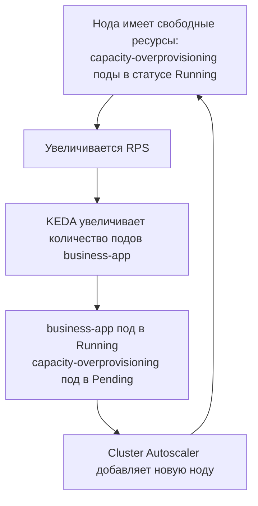
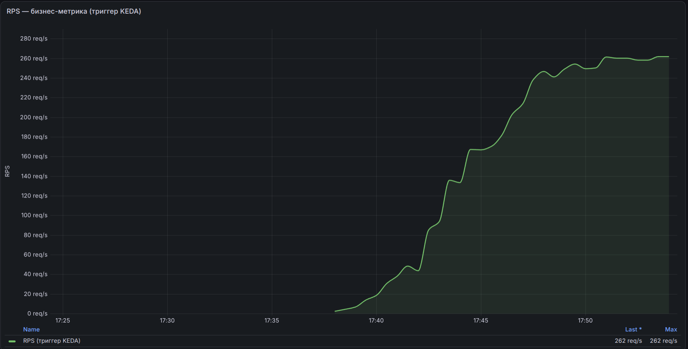
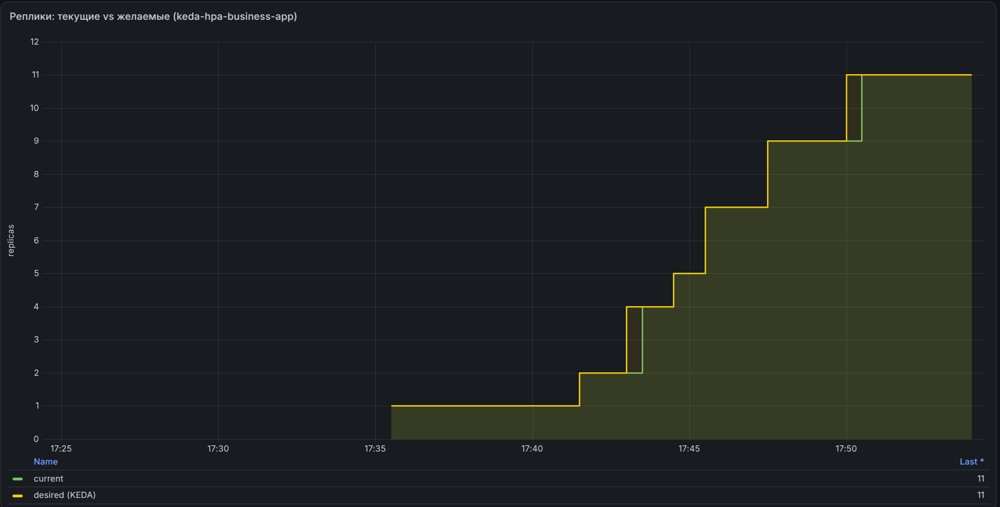
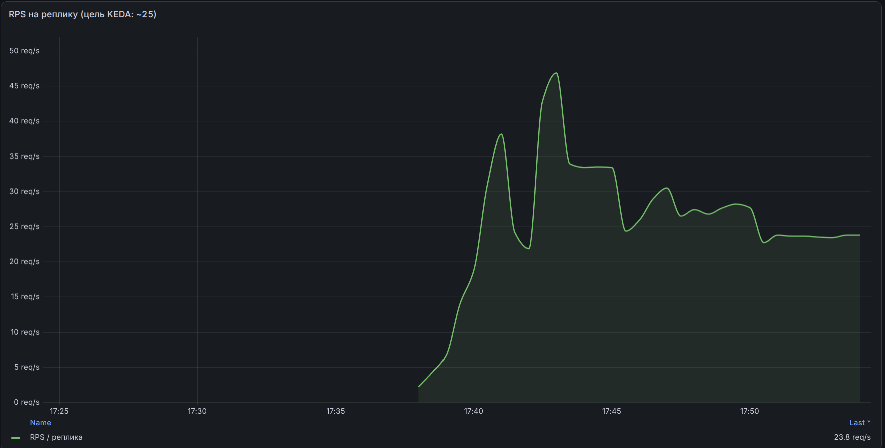
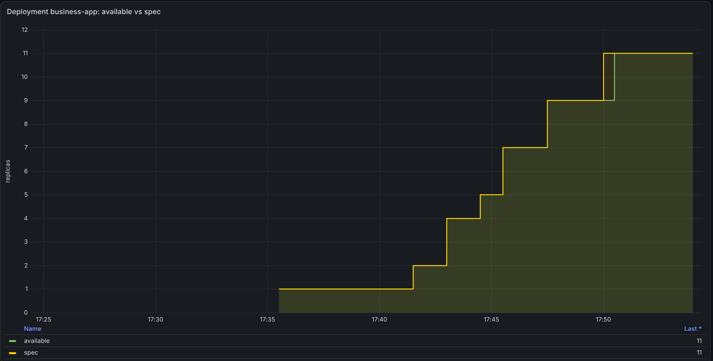
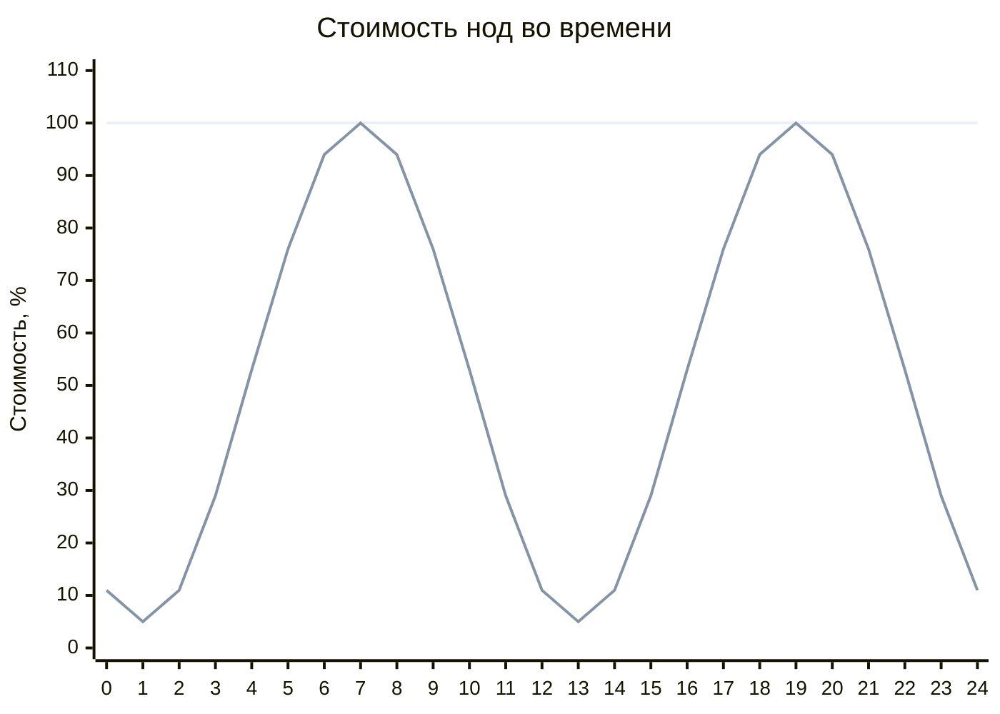

# Экономия на k8s нодах ночью и предварительно подготовленные k8s ноды утром используя overprovisioning поды
Ситуация, знакомая многим командам: в кластере Kubernetes живут обычные бизнес сервисы, нагрузка на которые днём растёт, а ночью падает. Обычно используют два плохих варианта: держать статический пул нод под дневной пик, которые ночью простаивают и стоят денег, или положиться на cluster autoscaling — и тогда при дневном росте нагрузки бизнес-поды проведут в статусе Pending до создания новой ноды.

Проблема ожидания, пока Cluster Autoscaler развернёт новую ноду, решается паттерном [node overprovisioning](https://kubernetes.io/docs/tasks/administer-cluster/node-overprovisioning/), настраиваемым через PriorityClass и механизмы Cluster Autoscaler: мы **заранее** запускаем ничего не делающие capacity-overprovisioning поды (в документации Kubernetes они называются placeholder-подами), которые занимают небольшую часть ресурсов нод. Когда приходит нагрузка и реплики бизнес-приложений увеличиваются — поды бизнес-приложений немедленно занимают освободившееся место, вытесняя capacity-overprovisioning под за секунды. Вытесненный capacity-overprovisioning под уходит в Pending, Cluster Autoscaler добавляет ноду.

Ключевая выгода паттерна — экономия. Ночью и утром, когда нагрузка падает, KEDA снижает число реплик бизнес-приложения, Cluster Autoscaler удаляет недозагруженные ноды, и кластер схлопывается до минимального числа нод. Утром при росте нагрузки capacity-overprovisioning поды отдают место мгновенно.

В этой статье разберём, как это устроено внутри, и развернём демо-стенд: от KEDA-автоскейлинга бизнес-приложения по RPS, который генерирует генератор нагрузки, до живого вытеснения capacity-overprovisioning подов, которое можно наблюдать своими глазами в `kubectl get events`.

## Как это работает: три механизма в связке

Прежде чем идти к практике, важно понять, что приоритетное вытеснение — это не одна фича, а результат работы трёх компонентов Kubernetes, которые существуют независимо друг от друга:

**1. Приоритет пода (PriorityClass).** Каждый под имеет приоритет 0 либо `priorityClassName` или приоритет выставляемый `globalDefault` из какого-либо PriorityClass. Приоритет учитывается в двух местах: планировщиком при выборе жертвы вытеснения (Preemption) и kubelet при eviction под давлением ресурсов.

**2. Вытеснение (Preemption).** Когда высокоприоритетный под не может разместиться, планировщик Kubernetes не просто переводит его в Pending — он ищет ноды, где, удалив один или несколько подов с приоритетом ниже, чем у кандидата, можно освободить достаточно ресурсов — и вытесняет их. Планировщик сравнивает приоритет каждого пода-жертвы с приоритетом кандидата по отдельности, а суммирует только освобождаемые ресурсы (`resources.requests`). Важный нюанс: планировщик сравнивает приоритеты только тогда, когда физически не может разместить под из-за нехватки запрошенных ресурсов (`resources.requests`). Без корректно выставленных requests вся эта механика не работает: планировщик видит только запрошенные ресурсы, а не фактическое потребление. Если requests не выставлены или занижены, ноды с точки зрения планировщика «пустые» — вытеснять некого, и высокоприоритетный под просто зависает в Pending. Полезно запомнить разделение ролей: **requests — триггер масштабирования, priority — право вытеснять**.

**3. Автоскейлинг нод (Cluster Autoscaler).** Вытеснённый capacity-overprovisioning под (или любой другой, который не помещается) переходит в статус Pending. Cluster Autoscaler видит поды, которые не могут разместиться, и разворачивает новую ноду.

Получается замкнутый цикл:



## Как это настроить

Настройка состоит из двух шагов: PriorityClass для capacity-overprovisioning подов и Deployment с контейнером `pause`.

> **Значения в примерах — не константы, а отправная точка.** Все числовые параметры ниже вы выставляете сами под своё приложение и инфраструктуру: `threshold` в RPS на реплику, `resources.requests/limits` бизнес-приложения и capacity-overprovisioning подов, число реплик (`replicas`) overprovisioning, профиль нагрузки генератора (`MIN_RPS`/`MAX_RPS`/`CYCLE`/`MIDPOINT`) и размер нод. В демо мы взяли ноду 2 vCPU / 4 ГБ, `threshold` = 25 RPS/реплику и запросы 250m CPU / 250Mi как разумные стартовые значения.

### Шаг 1. Создайте PriorityClass для capacity-overprovisioning подов

Для capacity-overprovisioning подов создайте класс с **отрицательным значением** — благодаря этому они становятся первой жертвой вытеснения:

```yaml
apiVersion: scheduling.k8s.io/v1
kind: PriorityClass
metadata:
  name: capacity-overprovisioning
value: -10
description: "Отрицательный приоритет для capacity-overprovisioning подов резервирования мощностей"
```
### Шаг 2. Разверните Deployment с capacity-overprovisioning подами

В манифесте Deployment явно укажите созданный отрицательный приоритет, минимальный образ `pause` и `terminationGracePeriodSeconds: 0`:

```yaml
apiVersion: apps/v1
kind: Deployment
metadata:
  name: overprovisioning
spec:
  replicas: 2
  selector:
    matchLabels:
      app: overprovisioning
  template:
    metadata:
      labels:
        app: overprovisioning
    spec:
      priorityClassName: capacity-overprovisioning
      terminationGracePeriodSeconds: 0 # Резерв должен освобождаться мгновенно
      containers:
      - name: pause
        image: registry.k8s.io/pause:3.10 # Контейнер, который просто «спит»
        resources:
          requests:
            cpu: 250m
            memory: 250Mi
          limits:
            cpu: 250m
            memory: 250Mi
```
Ключевые детали:

- **`value: -10`.** Отрицательный приоритет гарантирует, что обычные поды вытесняют capacity-overprovisioning поды: поды без `priorityClassName` имеют приоритет **0**, то есть выше. Значения ниже `-10` не обрабатываются Cluster Autoscale.
- **`requests` — это и есть размер резерва.** Контейнер `pause` потребляет копейки; capacity-overprovisioning под «занимает» ровно столько, сколько заявлено в `resources.requests`. Ресурсы которые могут отдать capacity-overprovisioning поды = `replicas × requests`.
- **`terminationGracePeriodSeconds: 0`.** Capacity-overprovisioning поды освобождаются мгновенно.

## Демо: вытеснение в живом кластере

Теперь самое интересное — развернём кластер и спровоцируем вытеснение. Предполагается, что k8s кластер c динамическими/autoscale нодами уже развёрнут.

### Шаг 0. Требуется установленный стек VictoriaMetrics

Для работы KEDA-триггера по RPS из Prometheus-совместимого API vmsingle требуется
установленный стек VictoriaMetrics.

### Шаг 1. Устанавливаем KEDA

KEDA добавляет в кластер горизонтальный автоскейлинг приложений по внешним метрикам. Почему выбран именно KEDA наглядно видно из сравнения с обычным HPA и связкой HPA + prometheus-adapter:

| Возможность | KEDA | prometheus-adapter | Обычный HPA |
|---|---|---|---|
| Скейлинг до нуля реплик | ✅ `minReplicaCount: 0` | ❌ не опускается ниже `minReplicas` | ❌ не опускается ниже `minReplicas` |
| Внешние метрики | ✅ триггеры в ScaledObject | ⚠️ PromQL-запросы мапятся в custom-metrics через ConfigMap | ❌ не поддерживает |
| Готовые скейлеры | ✅ 60+ скейлеров (Kafka, RabbitMQ, Redis и т. д.) | ⚠️ только Prometheus | ❌ нет |
| Простота настройки | ✅ один манифест ScaledObject | ⚠️ adapter + ConfigMap с правилами | ✅ встроен в k8s |
| Метрики CPU/памяти | ✅ триггеры `cpu` и `memory` | ✅ нативно (через HPA) | ✅ нативно |
| Смена источника метрик | ✅ меняется один блок в ScaledObject | ⚠️ правка правил adapter + перезапуск пода | ❌ зафиксирован на CPU/памяти |

```bash
helm repo add kedacore https://kedacore.github.io/charts
helm install keda kedacore/keda --namespace keda --create-namespace --version 2.20.2
```

### Шаг 2. Применяем PriorityClass

Конфиг указан выше — [priorityclasses.yaml](priorityclasses.yaml).
```bash
kubectl apply -f priorityclasses.yaml
```

### Шаг 3. Проверяем PriorityClass
```bash
$ kubectl get priorityclasses.scheduling.k8s.io
NAME                       VALUE        GLOBAL-DEFAULT   AGE
capacity-overprovisioning  -10          false            5s    ← для capacity-overprovisioning подов
system-cluster-critical    2000000000   false            10m
system-node-critical       2000001000   false            10m
```

### Шаг 4. Запускаем capacity-overprovisioning поды

Конфиг указан выше — [manifests/overprovisioning.yaml](manifests/overprovisioning.yaml).
```bash
kubectl apply -f manifests/overprovisioning.yaml
```
Две реплики с requests 250m CPU / 250Mi каждая — резерв суммарно 500m CPU / 500Mi. На начально «пустой» ноде (allocatable ~1930m CPU) обе реплики помещаются вместе, поэтому сразу после применения оба пода Running:

```bash
$ kubectl get pods -o wide
NAME                              READY   STATUS    NODE
overprovisioning-...-a1b2c        1/1     Running   cl1...-uabc
overprovisioning-...-d3e4f        1/1     Running   cl1...-uabc
```

Вытеснение и масштабирование нод начнутся позже, когда бизнес-нагрузка заполнит ноду (см. Шаг 8): новая реплика business-app вытеснит capacity-overprovisioning под, тот уйдёт в Pending, и только тогда Cluster Autoscaler развернёт новую ноду. Здесь мы лишь создаём «тёплый» резерв заранее.

Если же нода уже заполнена другими подами и второму capacity-overprovisioning поду не хватает места, он сразу уйдёт в Pending — и Cluster Autoscaler развернёт ноду уже на этом шаге:

```bash
$ kubectl get nodes
NAME                       STATUS   ROLES    AGE
cl1v2fmpkgn4srb2b1mm-uxyz   Ready    <none>   18m
cl1v2fmpkgn4srb2b1mm-uabc   Ready    <none>   2m    ← новая нода под capacity-overprovisioning под
```

### Шаг 5. Развёртываем бизнес-приложение

```bash
kubectl apply -f manifests/keda/business-app.yaml
```

- `business-app` ([manifests/keda/business-app.yaml](manifests/keda/business-app.yaml), исходники: [apps/business-app/](apps/business-app/)) — Go-приложение с HTTP API `/` и метриками Prometheus на `/metrics`. Каждая реплика запрашивает 250m CPU / 250Mi — ровно как capacity-overprovisioning под, поэтому при scale-out новая реплика (приоритет 0) гарантированно вытесняет его (приоритет -10).

### Шаг 6. Применяем ScaledObject — KEDA-триггер

`ScaledObject` описывает всю логику автоскейлинга business-app: какой запрос к vmsingle выполнять, сколько RPS держать на реплику, min/max реплик. Под капотом KEDA сам создаёт и обслуживает HPA.

```bash
kubectl apply -f manifests/keda/scaledobject.yaml
```

Полный манифест [manifests/keda/scaledobject.yaml](manifests/keda/scaledobject.yaml):

```yaml
# KEDA ScaledObject: масштабирование business-app по фактическому RPS.
# Метрику rate(business_app_http_requests_total[1m]) берём из VictoriaMetrics
# (совместим с Prometheus API) через endpoint vmsingle.
#
# Математика масштабирования:
#   желаемые реплики = ceil(суммарный RPS / 25)
#   25 RPS → 1 реплика, 300 RPS → 12 реплик, 600 RPS → 24 реплики.
apiVersion: keda.sh/v1alpha1
kind: ScaledObject
metadata:
  name: business-app
spec:
  scaleTargetRef:
    name: business-app
  minReplicaCount: 1 # Ночью (0 RPS) держим одну реплику
  maxReplicaCount: 60 # Потолок под пик 600 RPS: желаемые реплики = 600/25 = 24
  pollingInterval: 30 # Как часто опрашиваем метрику (секунды)
  useCachedMetrics: true # HPA читает закешированное значение вместо запроса к VictoriaMetrics на каждый sync
  fallback: # Если VictoriaMetrics недоступен — держим текущее число реплик
    behavior: currentReplicas
    failureThreshold: 3
    replicas: 1 # Обязательное поле; при behavior: currentReplicas значение не используется
  triggers:
  - type: prometheus
    metadata:
      serverAddress: http://vmsingle-vmks-victoria-metrics-k8s-stack.vmks.svc.cluster.local:8428
      query: |
        sum(rate(business_app_http_requests_total{route="root"}[1m]))
      threshold: "25" # Одна реплика обслуживает ~25 RPS
      activationThreshold: "3" # Ниже 3 RPS не поднимаем дополнительные реплики
```

- `scaledobject.yaml` ([manifests/keda/scaledobject.yaml](manifests/keda/scaledobject.yaml)) — триггер KEDA: Prometheus scaler берёт из vmsingle метрику `sum(rate(business_app_http_requests_total{route="root"}[1m]))` и держит ~25 RPS на реплику (min 1 / max 60; пик 600 RPS → 24 реплики).

### Шаг 7. Подключаем сбор метрик и запускаем генератор нагрузки

```bash
kubectl apply -f manifests/keda/vmservicescrape.yaml
kubectl apply -f manifests/keda/load-generator.yaml
```

- `load-generator` ([manifests/keda/load-generator.yaml](manifests/keda/load-generator.yaml), исходники: [apps/load-generator/](apps/load-generator/)) — плавно наращивает RPS на business-app по кривой.

### Шаг 8. Наблюдаем полный цикл: рост → вытеснение

Следим за репликами business-app и HPA, который создал KEDA:

```bash
$ kubectl get deployment business-app -w
$ kubectl get hpa keda-hpa-business-app -w
```

Когда RPS поднимается выше 25, KEDA добавляет реплику. Новая реплика (requests 250m CPU/250Mi, приоритет 0) не помещается на занятые ноды — планировщик вытесняет capacity-overprovisioning под (приоритет -10). Благодаря `terminationGracePeriodSeconds: 0` место освобождается сразу:

```bash
$ kubectl get events --sort-by=.lastTimestamp | grep -E 'Preempted|Scaled'
LAST SEEN   TYPE      REASON      OBJECT                          MESSAGE
20s         Normal    Preempted   pod/overprovisioning-...-a1b2c  By default/business-app-...-7g8h9 on node cl1...-uabc
35s         Normal    Killing     pod/overprovisioning-...-a1b2c  Stopping container pause
```

Ключевое событие — `Preempted ... By default/business-app-...`: планировщик явно показывает, кто кого вытеснил.

Вытесненный capacity-overprovisioning под уходит в Pending — это сигнал для Cluster Autoscaler развернуть новую ноду (провижининг ноды в облаке — минуты, в рамках `max = 5`):
```bash
$ kubectl get nodes -w
NAME                       STATUS   ROLES    AGE
cl1v2fmpkgn4srb2b1mm-uxyz   Ready    <none>   25m
cl1v2fmpkgn4srb2b1mm-uabc   Ready    <none>   9m
cl1v2fmpkgn4srb2b1mm-wxyz   Ready    <none>   47s   ← новая нода
```

На новой ноде capacity-overprovisioning поды снова становятся Running — «тёплый» резерв восстановлен:
```bash
$ kubectl get pods -o wide
NAME                              READY   STATUS    NODE
business-app-...-7g8h9            1/1     Running   cl1...-uabc
overprovisioning-...-a1b2c        1/1     Running   cl1...-wxyz
overprovisioning-...-d3e4f        1/1     Running   cl1...-wxyz
```

Полный цикл замкнулся: **рост RPS → KEDA поднимает реплики → мгновенное вытеснение → реальный под работает → новая нода**.

### Наблюдение в Grafana

Ниже — PromQL-запросы и скриншоты из Grafana, по которым можно наблюдать весь цикл.

**RPS бизнес-приложения** — входящий трафик на `/`, метрика, на которую смотрит KEDA-триггер:

```promql
sum(rate(business_app_http_requests_total{route="root"}[1m]))
```


**Реплики HPA** — текущее и желаемое количество реплик, которые KEDA выставил через HPA:

```promql
kube_horizontalpodautoscaler_status_current_replicas{horizontalpodautoscaler="keda-hpa-business-app", namespace="default"}
kube_horizontalpodautoscaler_status_desired_replicas{horizontalpodautoscaler="keda-hpa-business-app", namespace="default"}
```


**RPS на реплику** — метрика, которую KEDA держит на уровне ~25 RPS на реплику:

```promql
sum(rate(business_app_http_requests_total{route="root"}[1m])) / clamp_min(kube_horizontalpodautoscaler_status_current_replicas{horizontalpodautoscaler="keda-hpa-business-app", namespace="default"}, 1)
```


**Реплики Deployment** — доступные и заданные реплики бизнес-приложения:

```promql
kube_deployment_status_replicas_available{deployment="business-app", namespace="default"}
kube_deployment_spec_replicas{deployment="business-app", namespace="default"}
```


## Оптимизация запросов к VictoriaMetrics

KEDA опрашивает VictoriaMetrics не «на каждый чих», а по двум разным циклам, которые легко спутать:

| Период | Кто | Что делает |
|---|---|---|
| `pollingInterval` (30с) | KEDA | ходит в **VictoriaMetrics** за свежим значением метрики |
| `hpa-sync-period` (15с) | HPA | забирает **уже посчитанную** метрику из KEDA metrics server |

За частоту опроса VictoriaMetrics отвечает `pollingInterval` — это период, с которым prometheus-скейлер выполняет PromQL-запрос к VictoriaMetrics. HPA напрямую в VictoriaMetrics не ходит: он опрашивает API самого KEDA.

`hpa-sync-period` — это флаг `--horizontal-pod-autoscaler-sync-period` контроллера **kube-controller-manager**: он задаёт, как часто HPA-контроллер пересчитывает и забирает метрики у всех HPA. Поменять его можно только в одном месте — в настройках kube-controller-manager, и ни в каком манифесте (ни ScaledObject, ни HPA) он не указывается. В managed-кластере (как наш Yandex Managed Kubernetes) этот флаг управляется провайдером и недоступен для изменения; значение по умолчанию — 15с. Поэтому на практике мы влияем на нагрузку только через `pollingInterval` и `useCachedMetrics`, а `hpa-sync-period` воспринимаем как константу.

В [manifests/keda/scaledobject.yaml](manifests/keda/scaledobject.yaml) включены оба параметра:

```yaml
pollingInterval: 30  # Как часто KEDA опрашивает VictoriaMetrics (секунды)
useCachedMetrics: true # HPA читает закешированное значение вместо запроса к VM на каждый sync
```

**Что даёт `useCachedMetrics: true`.** Без кеша каждый sync HPA (каждые 15с) заставляет KEDA выполнять PromQL-запрос к vmsingle «на лету». С кешем KEDA сам опрашивает VM раз в `pollingInterval`, а HPA получает закешированное значение. Выгода растёт с числом ScaledObject'ов: при 300 приложениях без кеша VM получает 300 × (60/15) = 1200 запросов/мин (причём HPA синкаются одновременно — «залпом»), а с кешем — 300 × (60/30) = 600 запросов/мин. Плюс медленный vmsingle перестаёт тормозить цикл скейлинга: HPA не блокируется на ожидании VM.

**Цена кеша.** Метрика становится несвежей — задержка до одного `pollingInterval` (30с вместо ~15с). Для скейлинга по RPS это несущественно. А при падении VM кеш «залипает» и может какое-то время держать устаревшее число реплик — поэтому обязателен `fallback` (в манифесте настроен `currentReplicas`), который перекрывает эту дыру.

**Когда `pollingInterval` равен `hpa-sync-period` (15с = 15с).** Основной выигрыш кеша — меньше запросов к VM — обнуляется: KEDA всё равно опрашивает VM раз в 15с, как и HPA без кеша. Остаётся только косметика:

- уходит warning про `pollingInterval`;
- HPA не блокируется на ожидании медленного VM — читает значение из кеша;
- запросы к VM размазываются равномерно по циклу KEDA, а не «залпом» в момент sync HPA.

Чтобы получить реальный эффект, `pollingInterval` должен быть больше `hpa-sync-period`.

**Когда что крутить.** Для одного-двух скейлеров разница копеечная. Если VM начнёт упираться в лимиты по запросам или ScaledObject'ов станет много — основной рычаг это `pollingInterval`: увеличение интервала снижает нагрузку на VictoriaMetrics (поднятие с 30с до 60с — вдвое), но плата — более запоздалое реагирование на изменение RPS. Ищите баланс между нагрузкой на VM и скоростью отклика автоксейлинга.

## Важные нюансы для корректной работы

**Поды без requests и limits (BestEffort).** Под без requests и limits получает QoS-класс `BestEffort` — и вся приоритетная механика для него переворачивается. Это самая частая причина, почему приоритеты «не работают»:

- **Для планировщика он весит ноль.** Он разместится на любую ноду, даже полностью «занятую» по requests; по нехватке ресурсов он никогда не бывает Unschedulable, а значит — никогда не подаст Cluster Autoscaler сигнал «нужна нода».
- **Его нельзя вытеснить ради освобождения места.** Удаление пода с requests = 0 освобождает для планировщика ровно ноль, поэтому scheduler preemption не выбирает его жертвой: реально занятые им гигабайты памяти «непробиваемы» для приоритетного вытеснения.
- **Зато он первый кандидат на node-pressure eviction и OOM-killer.** Kubelet при нехватке памяти ранжирует поды сначала по превышению requests и только потом по приоритету — а BestEffort «превышает» всегда (requests = 0). Плюс kubelet выставляет BestEffort-подам максимальный `oom_score_adj = 1000`, поэтому kernel OOM-killer бьёт по ним первыми. Исключение — поды с классом `system-node-critical`: им kubelet выставляет `oom_score_adj = -997`, и для OOM-killer'а они вне очереди на убийство.

Парадокс: под без requests одновременно «неуязвим» для вытеснения планировщиком и «самый уязвимый» для eviction kubelet'ом — мониторинг без requests умрёт первым именно в момент инцидента, когда он нужнее всего. Вывод: для схемы «приоритеты + overprovisioning» requests должны стоять у всех участников — и у вытесняющих, и у жертв. Контролируйте это на уровне манифестов и values (например, проверяйте в CI, что у каждого контейнера указаны requests, — включая компоненты мониторинга вроде vmagent, vmsingle, alertmanager).

**Не путайте с eviction под давлением.** PriorityClass также влияет на порядок, в котором kubelet выселяет поды при нехватке памяти на ноде (node-pressure eviction) — но это другой механизм с другими причинами. Причём kubelet ранжирует поды иначе: сначала — превышение requests по дефицитному ресурсу, только потом — приоритет. QoS-класс пода в вытеснении планировщиком вообще не участвует. В этой статье речь о вытеснении планировщиком (scheduler preemption), которое происходит из-за нехватки места именно для нового пода.

## Стоимость нод: статические против node overprovisioning

Паттерн node overprovisioning экономит деньги за счёт того, что кластер следует за нагрузкой, а не держит постоянный пул нод под дневной пик. Схематично это выглядит так:



Графики выше показывают стоимость нод: прямая линия — плата за статические ноды, синусоида — плата за ноды при использовании паттерна node overprovisioning.

В примере ниже стоимость статических нод принята за 100%. Синусоида колеблется между минимумом 5% (базовая нагрузка ночью) и максимумом 100% (дневной пик). Средняя стоимость за период:

```
(100% + 5%) / 2 = 52.5%
```

То есть при применении паттерна node overprovisioning средняя стоимость нод ≈ **52.5%** от стоимости статических нод.

Важное замечание: Чтобы идеально уменьшать кол-во нод при уменьшении нагрузки у вас должен быть настроен deschduler. Но это тема отдельной статьи.

## Итоги

Мы настроили отрицательный PriorityClass для capacity-overprovisioning подов — и пронаблюдали полный цикл на живом бизнес-приложении: KEDA по RPS поднял реплики business-app, новые реплики мгновенно вытеснили capacity-overprovisioning поды и они ушли в Pending, Cluster Autoscaler добавил ноду. Паттерн node overprovisioning даёт «тёплый» резерв: место под будущий пик держится заранее, а при всплеске освобождается за секунды (вместо минут ожидания, пока облако подготовит новую ноду). На практике это оборачивается заметной экономией на нодах.
