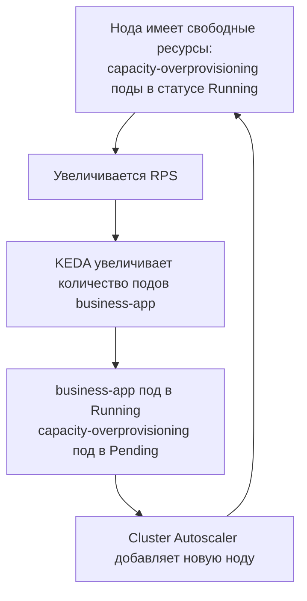

# Экономия на k8s нодах ночью и предварительно подготовленные k8s ноды утром используя overprovisioning поды
Ситуация, знакомая многим командам: в кластере Kubernetes живут обычные бизнес сервисы, нагрузка на которые днём растёт, а ночью падает. Обычно используют два плохих варианта: держать статический пул нод под дневной пик, которые ночью простаивают и стоят денег, или положиться на cluster autoscaling — и тогда при дневном росте нагрузки бизнес-поды проведут в статусе Pending до создания новой ноды.

Проблема ожидания, пока Cluster Autoscaler развернёт новую ноду, решается паттерном [node overprovisioning](https://kubernetes.io/docs/tasks/administer-cluster/node-overprovisioning/), настраиваемым через PriorityClass и механизмы Cluster Autoscaler: мы **заранее** запускаем ничего не делающие capacity-overprovisioning поды (в документации Kubernetes они называются placeholder-подами), которые занимают небольшую часть ресурсов нод. Когда приходит нагрузка и реплики бизнес-приложений увеличиваются — поды бизнес-приложений немедленно занимают освободившееся место, вытесняя capacity-overprovisioning под за секунды. Вытесненный capacity-overprovisioning под уходит в Pending, Cluster Autoscaler добавляет ноду.

Ключевая выгода паттерна — экономия. Ночью и утром, когда нагрузка падает, KEDA снижает число реплик бизнес-приложения, Cluster Autoscaler удаляет недозагруженные ноды, и кластер схлопывается до минимального числа нод. Утром при росте нагрузки capacity-overprovisioning поды отдают место мгновенно.

В этой статье разберём, как это устроено внутри, и развернём демо-стенд: от KEDA-автоскейлинга бизнес-приложения по RPS, который генерирует генератор нагрузки, до живого вытеснения capacity-overprovisioning подов, которое можно наблюдать своими глазами в `kubectl get events`.

## Как это работает: три механизма в связке

Прежде чем идти к практике, важно понять, что приоритетное вытеснение — это не одна фича, а результат работы трёх компонентов Kubernetes, которые существуют независимо друг от друга:

**1. Приоритет пода (PriorityClass).** Каждый под имеет приоритет 0 либо `priorityClassName` или приоритет выставляемый `globalDefault` из какого-либо PriorityClass. Приоритет учитывается в двух местах: планировщиком при выборе жертвы вытеснения (Preemption) и kubelet при eviction под давлением ресурсов.

**2. Вытеснение (Preemption).** Когда высокоприоритетный под не может разместиться, планировщик Kubernetes не просто переводит его в Pending — он ищет ноды, где, удалив один или несколько подов с приоритетом ниже, чем у кандидата, можно освободить достаточно ресурсов — и вытесняет их. Планировщик сравнивает приоритет каждого пода-жертвы с приоритетом кандидата по отдельности, а суммирует только освобождаемые ресурсы (`resources.requests`). Важный нюанс: планировщик сравнивает приоритеты только тогда, когда физически не может разместить под из-за нехватки запрошенных ресурсов (`resources.requests`). Без корректно выставленных requests вся эта механика не работает: планировщик видит только запрошенные ресурсы, а не фактическое потребление. Если requests не выставлены или занижены, ноды с точки зрения планировщика «пустые» — вытеснять некого, и высокоприоритетный под просто зависает в Pending.

**3. Автоскейлинг нод (Cluster Autoscaler).** Вытеснённый capacity-overprovisioning под (или любой другой, который не помещается) переходит в статус Pending. Cluster Autoscaler видит поды, которые не могут разместиться, и разворачивает новую ноду.

Получается замкнутый цикл:



## Как это настроить

Настройка состоит из двух шагов: PriorityClass для capacity-overprovisioning подов и Deployment с контейнером `pause`.

### Шаг 1. Создайте PriorityClass для capacity-overprovisioning подов

Для capacity-overprovisioning подов создайте класс с **отрицательным значением** — благодаря этому они становятся первой жертвой вытеснения:

```yaml
apiVersion: scheduling.k8s.io/v1
kind: PriorityClass
metadata:
  name: capacity-overprovisioning
value: -10
description: "Отрицательный приоритет для capacity-overprovisioning подов резервирования мощностей"
```
### Шаг 2. Разверните Deployment с capacity-overprovisioning подами

В манифесте Deployment явно укажите созданный отрицательный приоритет, минимальный образ `pause` и `terminationGracePeriodSeconds: 0`:

```yaml
apiVersion: apps/v1
kind: Deployment
metadata:
  name: overprovisioning
spec:
  replicas: 2
  selector:
    matchLabels:
      app: overprovisioning
  template:
    metadata:
      labels:
        app: overprovisioning
    spec:
      priorityClassName: capacity-overprovisioning
      terminationGracePeriodSeconds: 0 # Резерв должен освобождаться мгновенно
      containers:
      - name: pause
        image: registry.k8s.io/pause:3.10 # Контейнер, который просто «спит»
        resources:
          requests:
            cpu: 250m
            memory: 250Mi
          limits:
            cpu: 250m
            memory: 250Mi
```
Ключевые детали:

- **`value: -10`.** Отрицательный приоритет гарантирует, что обычные поды вытесняют capacity-overprovisioning поды: поды без `priorityClassName` имеют приоритет **0**, то есть выше. Значения ниже `-10` не обрабатываются Cluster Autoscale.
- **`requests` — это и есть размер резерва.** Контейнер `pause` потребляет копейки; capacity-overprovisioning под «занимает» ровно столько, сколько заявлено в `resources.requests`. Ресурсы которые могут отдать capacity-overprovisioning поды = `replicas × requests`.
- **`terminationGracePeriodSeconds: 0`.** Capacity-overprovisioning поды освобождаются мгновенно.

## Демо: вытеснение в живом кластере

Теперь самое интересное — развернём кластер и спровоцируем вытеснение. Предполагается, что k8s кластер c динамическими/autoscale нодами уже развёрнут.

### Шаг 0. Устанавливаем VictoriaMetrics

```
$ helm upgrade --install vmks \
    oci://ghcr.io/victoriametrics/helm-charts/victoria-metrics-k8s-stack \
    --namespace vmks --create-namespace \
    --wait --version 0.90.2 --timeout 15m \
    -f vmks-values.yaml
```

### Шаг 1. Устанавливаем KEDA

KEDA добавляет в кластер горизонтальный автоскейлинг приложений по внешним метрикам — в нашем случае по RPS из Prometheus-совместимого API vmsingle:

```bash
helm repo add kedacore https://kedacore.github.io/charts
helm install keda kedacore/keda --namespace keda --create-namespace --version 2.20.2
```

### Шаг 2. Применяем PriorityClass
```bash
kubectl apply -f priorityclasses.yaml
```

### Шаг 3. Проверяем PriorityClass
```bash
$ kubectl get priorityclasses.scheduling.k8s.io
NAME                       VALUE        GLOBAL-DEFAULT   AGE
capacity-overprovisioning  -10          false            5s    ← для capacity-overprovisioning подов
system-cluster-critical    2000000000   false            10m
system-node-critical       2000001000   false            10m
```

### Шаг 2. Запускаем capacity-overprovisioning поды

```bash
kubectl apply -f manifests/overprovisioning.yaml
```
Две реплики с requests 250m CPU / 250Mi каждая — Cluster Autoscaler разворачивает под них вторую ноду:

```bash
$ kubectl get pods -o wide
NAME                              READY   STATUS    NODE
overprovisioning-...-a1b2c        1/1     Running   cl1...-uabc   ← «тёплая» нода
overprovisioning-...-d3e4f        0/1     Pending                 ← второй capacity-overprovisioning под ждёт

$ kubectl get nodes
NAME                       STATUS   ROLES    AGE
cl1v2fmpkgn4srb2b1mm-uxyz   Ready    <none>   18m
cl1v2fmpkgn4srb2b1mm-uabc   Ready    <none>   2m    ← новая нода под capacity-overprovisioning под
```


### Шаг 4. Развёртываем бизнес-приложение, KEDA-триггер и генератор нагрузки

```bash
kubectl apply -f manifests/keda/business-app.yaml
kubectl apply -f manifests/keda/scaledobject.yaml
kubectl apply -f manifests/keda/load-generator.yaml
kubectl apply -f manifests/keda/vmservicescrape.yaml
```

- `business-app` — Go-приложение с HTTP API `/` и метриками Prometheus на `/metrics`. Каждая реплика запрашивает 250m CPU / 250Mi — ровно как capacity-overprovisioning под, поэтому при scale-out новая реплика (приоритет 0) гарантированно вытесняет его (приоритет -10).
- `scaledobject.yaml` — триггер KEDA: Prometheus scaler берёт из vmsingle метрику `sum(rate(business_app_http_requests_total{route="root"}[1m]))` и держит ~25 RPS на реплику (min 1 / max 4).
- `load-generator` — гоняет на business-app лестницу RPS «день/ночь»: ночь 0 RPS (2м) → 5 RPS (3м) → 20 RPS (3м) → 60 RPS (3м) → пик 100 RPS (5м) → спад 20 RPS (3м) → ночь 0 RPS (2м), затем повтор бесконечно.

### Шаг 5. Наблюдаем полный цикл: рост → вытеснение

Следим за репликами business-app и HPA, который создал KEDA:

```bash
$ kubectl get deployment business-app -w
$ kubectl get hpa keda-hpa-business-app -w
```

Когда лестница RPS поднимается выше 25 RPS, KEDA добавляет реплику. Новая реплика (requests 250m CPU/250Mi, приоритет 0) не помещается на занятые ноды — планировщик вытесняет capacity-overprovisioning под (приоритет -10). Благодаря `terminationGracePeriodSeconds: 0` место освобождается сразу:

```bash
$ kubectl get events --sort-by=.lastTimestamp | grep -E 'Preempted|Scaled'
LAST SEEN   TYPE      REASON      OBJECT                          MESSAGE
20s         Normal    Preempted   pod/overprovisioning-...-a1b2c  By default/business-app-...-7g8h9 on node cl1...-uabc
35s         Normal    Killing     pod/overprovisioning-...-a1b2c  Stopping container pause
```

Ключевое событие — `Preempted ... By default/business-app-...`: планировщик явно показывает, кто кого вытеснил.

Вытесненный capacity-overprovisioning под уходит в Pending — это сигнал для Cluster Autoscaler развернуть новую ноду (провижининг ноды в облаке — минуты, в рамках `max = 5`):
```bash
$ kubectl get nodes -w
NAME                       STATUS   ROLES    AGE
cl1v2fmpkgn4srb2b1mm-uxyz   Ready    <none>   25m
cl1v2fmpkgn4srb2b1mm-uabc   Ready    <none>   9m
cl1v2fmpkgn4srb2b1mm-wxyz   Ready    <none>   47s   ← новая нода
```

На новой ноде capacity-overprovisioning поды снова становятся Running — «тёплый» резерв восстановлен:
```bash
$ kubectl get pods -o wide
NAME                              READY   STATUS    NODE
business-app-...-7g8h9            1/1     Running   cl1...-uabc
overprovisioning-...-a1b2c        1/1     Running   cl1...-wxyz
overprovisioning-...-d3e4f        1/1     Running   cl1...-wxyz
```

Полный цикл замкнулся: **рост RPS → KEDA поднимает реплики → мгновенное вытеснение → реальный под работает → новая нода**.

## Важные нюансы для корректной работы

**Запросы ресурсов (Requests).** Вытеснение сработает только в том случае, если у ваших подов чётко прописаны `resources.requests`. Kubernetes сравнивает приоритеты только тогда, когда физически не может разместить под из-за нехватки запрошенных ресурсов. Под без requests для планировщика «весит ноль» — он не вытеснит никого и сам не станет причиной масштабирования. Это самая частая причина, почему приоритеты «не работают». Полезно запомнить разделение ролей: **requests — триггер масштабирования, priority — право вытеснять**. Приоритет сам по себе не заставляет Cluster Autoscaler создавать ноды — тот реагирует только на поды в состоянии `Unschedulable` из-за нехватки ресурсов.

**Поды без requests и limits (BestEffort).** Если в namespace нет LimitRange, под без requests и limits получает QoS-класс `BestEffort` — и вся приоритетная механика для него переворачивается:

- **Для планировщика он весит ноль.** Он разместится на любую ноду, даже полностью «занятую» по requests; по нехватке ресурсов он никогда не бывает Unschedulable, а значит — никогда не подаст Cluster Autoscaler сигнал «нужна нода».
- **Его нельзя вытеснить ради освобождения места.** Удаление пода с requests = 0 освобождает для планировщика ровно ноль, поэтому scheduler preemption не выбирает его жертвой: реально занятые им гигабайты памяти «непробиваемы» для приоритетного вытеснения.
- **Зато он первый кандидат на node-pressure eviction и OOM-killer.** Kubelet при нехватке памяти ранжирует поды сначала по превышению requests и только потом по приоритету — а BestEffort «превышает» всегда (requests = 0). Плюс kubelet выставляет BestEffort-подам максимальный `oom_score_adj = 1000`, поэтому kernel OOM-killer бьёт по ним первыми — независимо от назначенного PriorityClass.

Парадокс: под без requests одновременно «неуязвим» для вытеснения планировщиком и «самый уязвимый» для eviction kubelet'ом — мониторинг без requests умрёт первым именно в момент инцидента, когда он нужнее всего. Вывод: для схемы «приоритеты + overprovisioning» requests должны стоять у всех участников — и у вытесняющих, и у жертв. Если LimitRange не используется, контролируйте это на уровне манифестов и values (например, проверяйте в CI, что у каждого контейнера указаны requests, — включая компоненты мониторинга вроде vmagent, vmsingle, alertmanager).

**Не путайте с eviction под давлением.** PriorityClass также влияет на порядок, в котором kubelet выселяет поды при нехватке памяти на ноде (node-pressure eviction) — но это другой механизм с другими причинами. Причём kubelet ранжирует поды иначе: сначала — превышение requests по дефицитному ресурсу, только потом — приоритет. QoS-класс пода в вытеснении планировщиком вообще не участвует. В этой статье речь о вытеснении планировщиком (scheduler preemption), которое происходит из-за нехватки места именно для нового пода.

## Итоги

Мы настроили отрицательный PriorityClass для capacity-overprovisioning подов — и пронаблюдали полный цикл на живом бизнес-приложении: KEDA по RPS поднял реплики business-app, новые реплики мгновенно вытеснили capacity-overprovisioning поды, буфер ушёл в Pending, Cluster Autoscaler добавил ноду, и резерв восстановился. Паттерн node overprovisioning даёт «тёплый» резерв: место под будущий пик держится заранее, а при всплеске освобождается за секунды (вместо минут ожидания, пока облако подготовит новую ноду).

Все конфигурации из статьи:

- [priorityclasses.yaml](priorityclasses.yaml) — PriorityClass для capacity-overprovisioning подов с отрицательным значением
- [manifests/overprovisioning.yaml](manifests/overprovisioning.yaml) — capacity-overprovisioning поды для «тёплого» резерва
- [manifests/keda/business-app.yaml](manifests/keda/business-app.yaml) — бизнес-приложение (Deployment + Service)
- [manifests/keda/scaledobject.yaml](manifests/keda/scaledobject.yaml) — KEDA ScaledObject, масштабирование по RPS из VictoriaMetrics
- [manifests/keda/load-generator.yaml](manifests/keda/load-generator.yaml) — генератор нагрузки с профилем RPS «день/ночь»
- [apps/business-app/](apps/business-app/) — исходники бизнес-приложения (Go)
- [apps/load-generator/](apps/load-generator/) — исходники генератора нагрузки (Go)
